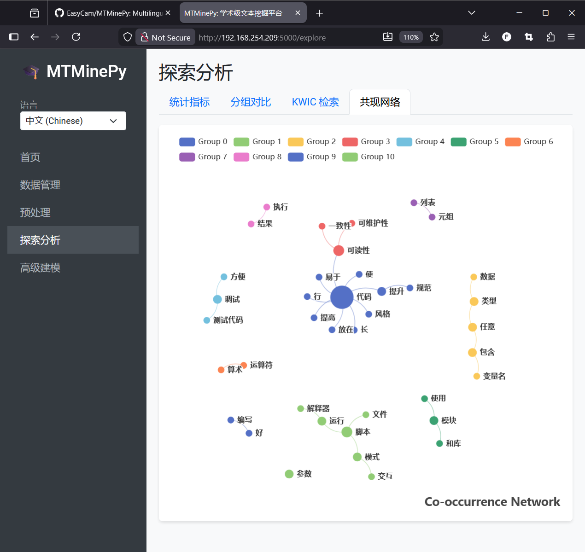
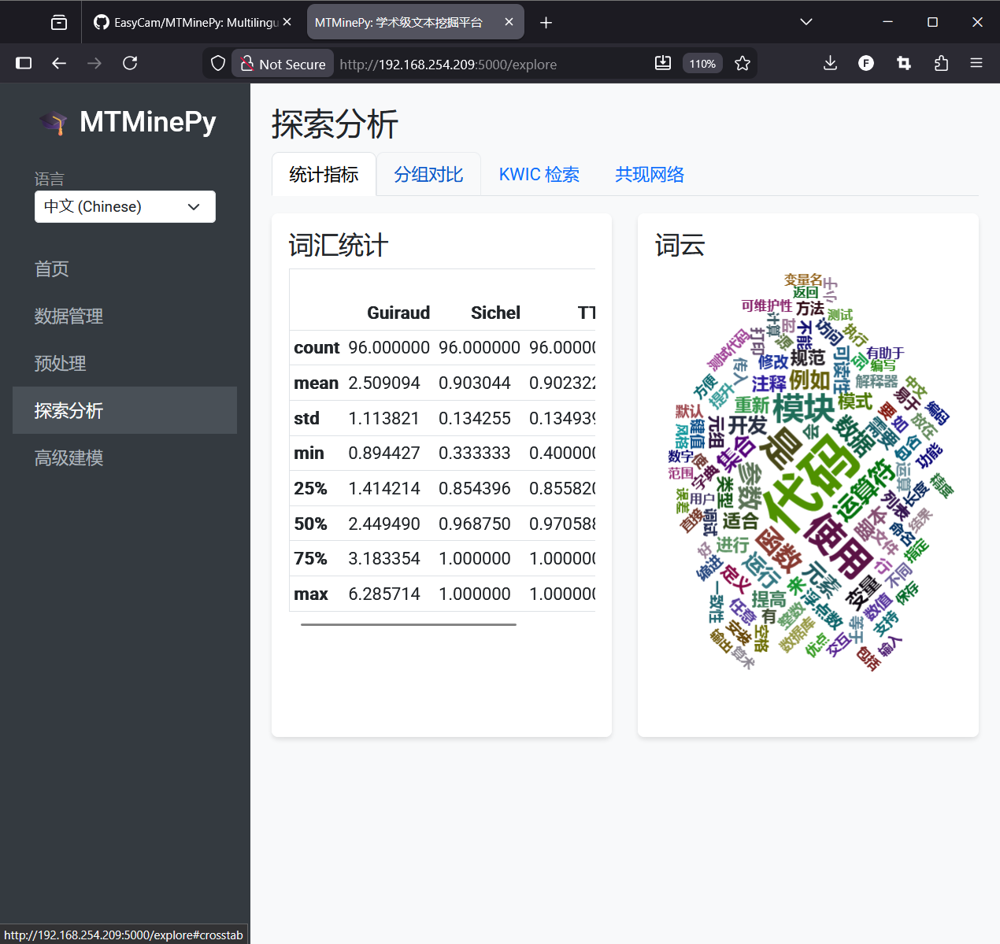
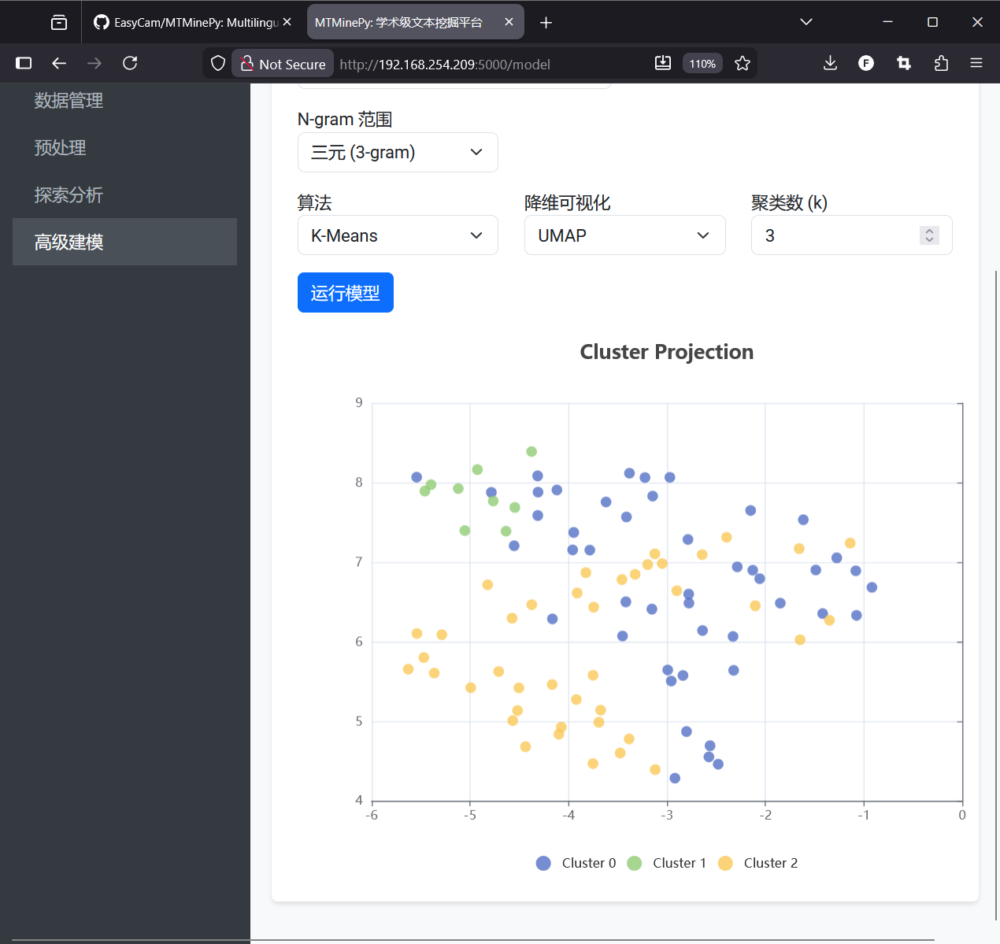
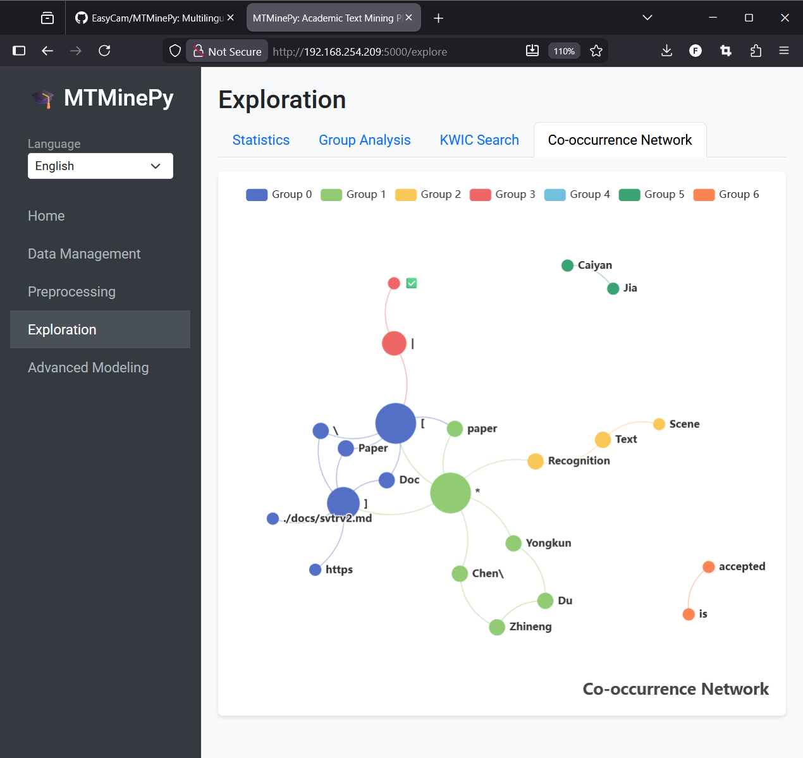
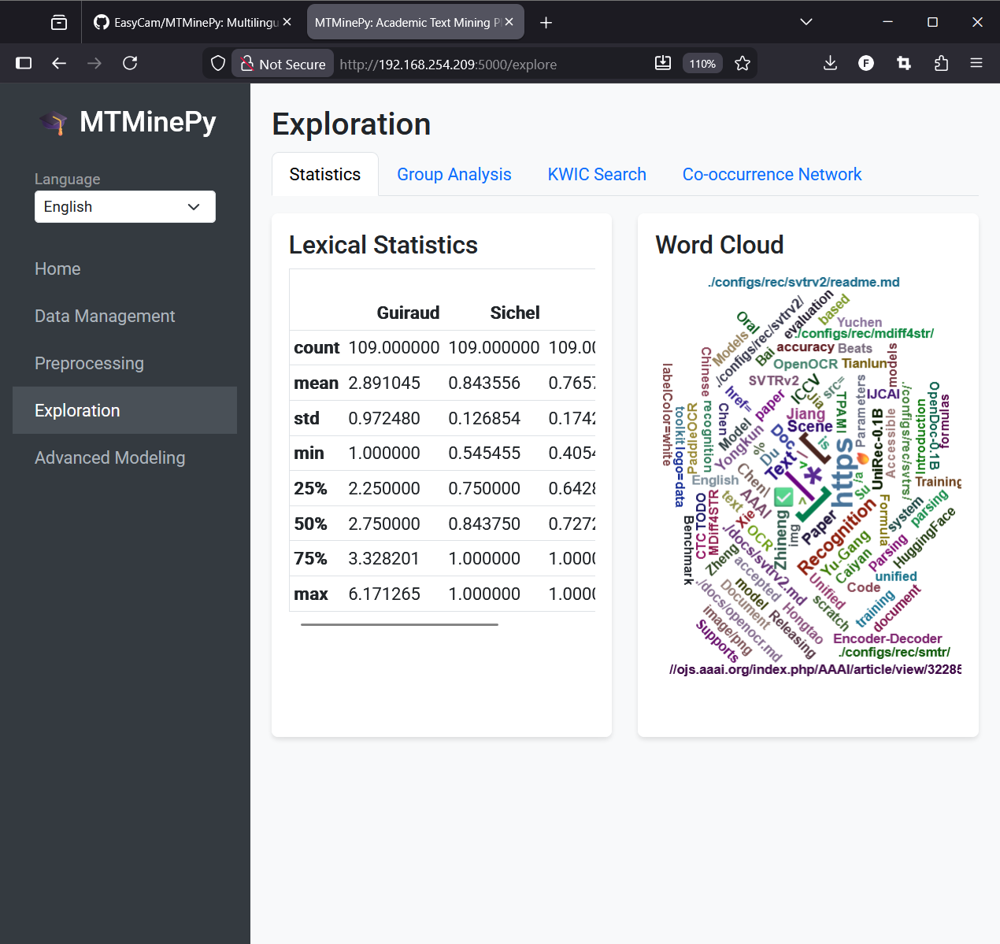
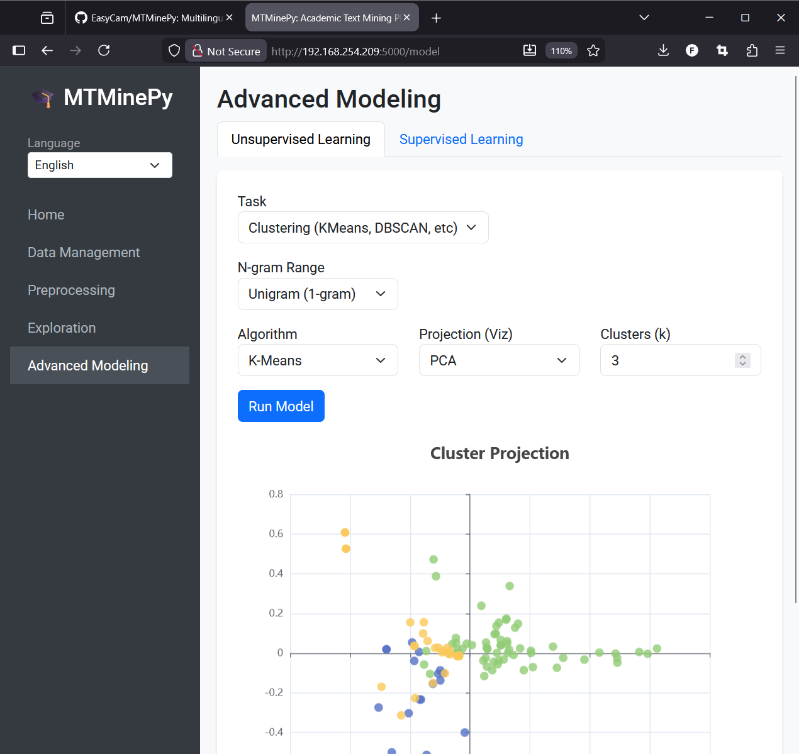

# MTMinePy - 基于 Python 的多语言文本挖掘平台

[](https://pypi.org/project/mtminepy/)
[](https://www.gnu.org/licenses/gpl-3.0)

**MTMinePy** 是一个基于 Python 的学术级文本挖掘平台，致敬并复刻了 MTMineR 的核心理念。它是一个综合性的 Flask Web 应用程序，专为强大的文本挖掘和分析而设计，支持交互式可视化和高级建模功能。

## 核心功能
- **高级 NLP**: 集成了 `jieba`, `HanLP`, `LTP`, `Spacy`, 和 `NLTK` 等主流自然语言处理库。
- **多语言支持**: 原生支持中文、英文、日文等 10+ 种语言的分析。
- **交互式可视化**: 采用 **ECharts** 引擎，支持响应式力导向网络图、动态词云和交互式散点图。
- **学术级度量分析**: 支持高级距离函数 (Hsim, Close, Esim) 和高端可视化。
- **高级建模**: 包含全面的无监督学习 (聚类, 主题建模) 和有监督学习 (分类) 算法套件。

## 效果展示

### 中文分析 (Chinese Analysis)
| 共现网络 (Co-occurrence) | 词云 (Word Cloud) | 聚类投影 (Clustering) |
|:---:|:---:|:---:|
|  |  |  |

### 英文分析 (English Analysis)
| 共现网络 (Co-occurrence) | 词云 (Word Cloud) | 聚类投影 (Clustering) |
|:---:|:---:|:---:|
|  |  |  |

## 安装

### 从 PyPI 安装 (推荐)

```bash
pip install mtminepy
```

如需安装所有可选 NLP 后端 (Janome, spaCy, HanLP, LTP, UMAP, Boruta 等):

```bash
pip install mtminepy[full]
```

### 从源码安装

```bash
git clone https://github.com/EasyCam/MTMinePy.git
cd MTMinePy
pip install -e .
```

## 使用方法

### 命令行运行

安装后直接运行:

```bash
mtminepy
```

启动后，请在浏览器中访问 `http://localhost:5000`。

### 命令行选项

```bash
mtminepy --help
mtminepy --port 8080          # 自定义端口
mtminepy --host 127.0.0.1    # 仅绑定本地
mtminepy --debug              # Flask 调试模式
mtminepy --version            # 显示版本
```

### 在 Python 中使用

```python
from mtminepy.app import create_app

app = create_app()
app.run(host='0.0.0.0', port=5000)
```

## 高级功能

### 建模算法
MTMinePy 支持广泛的标准机器学习算法用于文本分析：
*   **特征工程**: TF-IDF, 词袋模型 (Bag of Words), N-gram (N元语法) 支持。
*   **无监督学习**:
    *   **主题建模**: 隐含狄利克雷分布 (LDA), 非负矩阵分解 (NMF), 结构化主题模型 (STM)。
    *   **聚类分析**: K-Means, 层次聚类 (Agglomerative), DBSCAN, 谱聚类 (Spectral Clustering)。
    *   **降维可视化**: PCA, t-SNE, UMAP, 因子分析 (Factor Analysis)。
*   **有监督学习** (分类):
    *   支持向量机 (SVM)
    *   随机森林 (Random Forest)
    *   线性判别分析 (LDA)
    *   二次判别分析 (QDA)
    *   逻辑回归 (Elastic Net)

### 数学模型 (距离与相似度)
MTMinePy 支持用于学术研究的高级度量指标：

#### 高级自定义相似度度量
1.  **Hsim (Yang Fengzhao, 2007)**
    $$ Hsim(x_i, x_j) = \frac{1}{n} \sum_{k=1}^n \frac{1}{1+|x_{ik}-x_{jk}|} $$
    
2.  **Close (Shao Changsheng, et al., 2011)**
    $$ Close(x_i, x_j) = \frac{1}{n} \sum_{k=1}^n e^{-|x_{ik}-x_{jk}|} $$

3.  **Esim (Wang Xiaoyang, et al., 2013)**
    $$ Esim(x_{ik}, x_{jk}) = \frac{1}{n} \sum_{k=1}^d \omega_k e^{-\frac{|x_{ik}-x_{jk}|}{|x_{ik}-x_{jk}|+|x_{ik}+x_{jk}|/2}} $$
